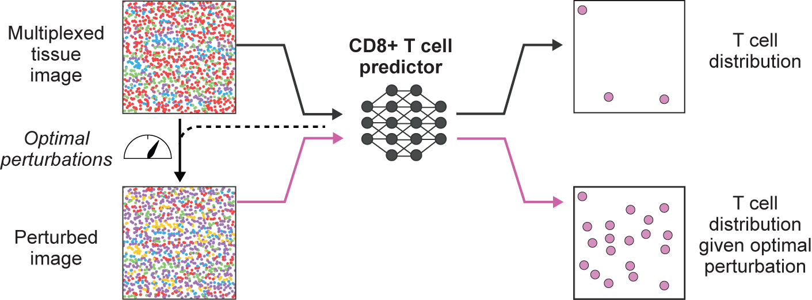

Morpheus is an integrated deep learning framework that takes large scale spatial omics profiles of patient tumors, and combines a formulation of T-cell infiltration prediction as a self-supervised machine learning problem with a counterfactual optimization strategy to generate minimal tumor perturbations predicted to boost T-cell infiltration.



Update: We are currently working on tutorial notebooks for running optimization on Slurm with fan-out across multiple CPU nodes, stay tuned!

## Getting Started

### Prerequisites

- Python >=3.9, <3.12
- PyTorch Lightning 2.2.0 or higher
- CUDA 11.7 or higher (for GPU acceleration)
- Other dependencies listed in `requirements.txt`

Note numpy 2.0 or above not currently supported

### Installation

#### Option 1: Using pip (PyPI)

Run the following in the command line

```bash
pip install morpheus-spatial
```

#### Option 2: From Source

To install Morpheus from source, clone the repository and install the dependencies:

```bash
git clone https://github.com/neonine2/morpheus-spatial.git
cd morpheus-spatial
pip install -r requirements.txt
pip install .
```

### Tutorial

See `tutorial_notebook.ipynb` for a complete, self-contained workflow on using Morpheus to generate therapeutic strategies.

### Known Issues

#### OpenMP Conflicts on macOS

Some users may encounter warnings about conflicting OpenMP libraries. If you see a warning about Intel OpenMP and LLVM OpenMP being loaded at the same time, please see [https://github.com/joblib/threadpoolctl/blob/master/multiple_openmp.md](https://github.com/joblib/threadpoolctl/blob/master/multiple_openmp.md) for more information and possible workarounds.

### Repository Structure

- **`assets/`**: Contains images and other assets used in the documentation and the project.
- **`examples/`**: Example scripts and notebooks demonstrating various use cases of the Morpheus framework.
  - **`tutorial.ipynb`**: A notebook demonstrating how to reproduce the primary analyses of the paper.
- **`reproduction/`**: Includes Jupyter notebooks and scripts for reproducing the main analyses presented in the associated research paper.
  - **`reproduction_notebook.ipynb`**: A notebook demonstrating how to reproduce the primary analyses of the paper.
- **`src/`**: The main package directory containing all core modules and functions.
- **`tests/`**: Contains unit tests for the different modules of the package.
- **`requirements.txt`**: A file listing all Python dependencies required to run the project.
